# 📚 DocLore — Handbook Copilot

> **Ask one handbook or several. Get grounded answers, inspect the sources, and spot policy changes across versions.**

DocLore is a web-based retrieval-augmented generation (RAG) application for exploring PDF handbooks, policies, and other reference documents. It combines page-aware PDF extraction, semantic and keyword retrieval, passage reranking, and a Groq language model instructed to answer from retrieved document evidence.

The workspace is designed to make answers reviewable: citations link back to the relevant PDF, and multi-handbook answers can compare selected documents and flag directly conflicting versions.

## ✨ Highlights

| Capability | What it does |
| --- | --- |
| 📄 **Choose the source documents** | Select one, several, or all PDFs from the handbook dropdown. Multi-document questions search the selected handbooks. |
| 🔎 **Compare across handbooks** | Ask about common policies across documents. When evidence supports a side-by-side comparison, DocLore can return a Markdown table organized by handbook. |
| ⚠️ **Flag version conflicts** | When retrieved passages make incompatible claims about the same policy, the answer presents the newer policy first and places the older-version warning and citations in a highlighted box. Unrelated documents are not treated as conflicting policies. |
| 📌 **Trace answers to sources** | Answers are grounded in retrieved passages. Citation controls show the source document and page, with source excerpts available for review. |
| 🧭 **Jump to evidence in the PDF** | Open a citation to navigate the PDF viewer to its page and highlight the cited passage when possible. |
| ⏳ **See indexing progress** | PDF indexing reports its current stage and live percentage. The status disappears when indexing completes. |
| 🗂️ **Manage a document library** | Upload PDFs, preview them, open them from quick access, and remove documents from the workspace. |
| 🧑‍💼 **Personalize the workspace** | Profile settings include display name, avatar, role, theme, and an email-notification preference. The workspace also supports light and dark themes. |
| 🔐 **Sign in securely** | Email and password accounts use email verification. Google OAuth is available when configured. |
| 🧠 **Inspect answer quality signals** | The chat can show retrieval and generation timings, confidence, and a grounding indicator alongside answers. |

### Version conflict behavior

For multi-handbook answers, DocLore checks whether retrieved passages address the **same policy** and state incompatible rules. A difference in topic, an extra detail, or a rule found in only one document is not by itself a contradiction.

When the evidence establishes a conflict, the answer is organized in this order:

1. **Current policy** — the newer rule, with its handbook and page/section where available.
2. **Conflict detected** — a highlighted warning with the older rule and its citation, followed by a supersession statement when the version chronology is supported.
3. **Sources** — references to both versions for verification.

If the passages conflict but the available dates do not establish which version is newer, DocLore should identify that uncertainty rather than claim that one version supersedes the other. Answers are limited to retrieved evidence; the model may not be able to detect a conflict if the relevant passages were not retrieved.

## 🧭 How it works

```mermaid
flowchart LR
    A[Upload handbook PDF] --> B[Extract page text]
    B --> C[Split into overlapping passages]
    C --> D[Create batched embeddings]
    D --> E[Build searchable index]
    Q[Ask a question] --> F[Search selected handbook or handbooks]
    E --> F
    F --> G[Semantic and keyword retrieval]
    G --> H[Cross-encoder reranking]
    H --> I[Grounded answer with source context]
    I --> J{Multiple handbooks?}
    J -->|Yes| K[Compare relevant policies and flag conflicts]
    J -->|No| L[Answer from the selected handbook]
    K --> M[Render answer and citations]
    L --> M
    M --> N[Open citation in PDF viewer]
```



### Retrieval pipeline

1. **Extract:** Read page text from the PDF and keep page labels attached to passages.
2. **Chunk:** Split text into passages of about 900 characters with a 160-character overlap.
3. **Embed and index:** Generate normalized embeddings with `all-MiniLM-L6-v2` in batches and create a FAISS vector index. Build lexical retrieval metadata for BM25 matching.
4. **Retrieve:** Search each selected handbook using semantic similarity and lexical matching. Normalize common spelling variations and rerank candidate passages with a cross-encoder when enabled.
5. **Answer:** Send the selected evidence to the configured Groq model with instructions to answer only from that context and cite supplied page labels.
6. **Review:** Show citations and source excerpts in the chat. Selecting a citation navigates the PDF viewer to the corresponding passage when possible.

## 🖥️ Workspace experience

- **Three-panel layout:** conversation history and quick-access handbooks, the chat, and a PDF viewer.
- **Resizable panels:** adjust the workspace to give more room to the chat or reference document; panels can also be hidden.
- **Conversation tools:** search conversation history, start a new chat, clear a conversation, or remove saved conversation threads.
- **Handbook picker:** check individual PDFs in the dropdown or use **Select all**. Clear the selection to return to all-handbook search.
- **PDF viewer controls:** search within the document, change zoom, navigate pages, and inspect cited passages.
- **Profile and preferences:** update profile details and choose a light or dark appearance.
- **Responsive interface:** the workspace adapts to smaller screens, with keyboard-accessible controls and visible focus states.

## 🛠️ Tech stack

| Layer | Technology |
| --- | --- |
| Web application | Python, Flask, Jinja templates |
| PDF text extraction | pypdf and page-aware PDF utilities |
| Embeddings | Sentence Transformers (`all-MiniLM-L6-v2`) |
| Vector search | FAISS |
| Lexical retrieval | BM25 scoring |
| Passage reranking | Sentence Transformers cross-encoder |
| Answer generation | Groq API |
| Accounts and metadata | SQLite |
| Front end | HTML, CSS, and JavaScript |

## 🚀 Run locally

### Requirements

- Python 3.10 or newer (the development environment uses Python 3.13)
- A Groq API key for answer generation
- Internet access on first run to download the embedding and reranker models
- SMTP credentials for email verification; Google OAuth credentials are optional

### 1. Create a virtual environment

**Windows PowerShell**

```powershell
python -m venv .venv
.venv\Scripts\Activate.ps1
```

**macOS / Linux**

```bash
python -m venv .venv
source .venv/bin/activate
```

### 2. Install dependencies

```bash
pip install -r requirements.txt
```

### 3. Configure environment variables

Copy `.env.example` to `.env`. Add the required model settings and a stable session secret:

```env
GROQ_API_KEY=your-groq-api-key
GROQ_MODEL=openai/gpt-oss-120b
FLASK_SECRET_KEY=replace-with-a-long-random-secret
```

`GROQ_MODEL` defaults to `openai/gpt-oss-120b`; choose a model available to your Groq account if needed. Configure SMTP for email verification. To enable Google sign-in, add the OAuth credentials and register `http://127.0.0.1:5000/auth/google/callback` as an authorized redirect URI. Never commit `.env` or real credentials.

### 4. Start DocLore

```bash
python app.py
```

Open [http://127.0.0.1:5000](http://127.0.0.1:5000), create or sign in to an account, upload a PDF, and ask a question. Email/password accounts must verify their email before login. Google sign-in appears when its credentials are configured.

## ⚙️ Configuration

| Variable | Purpose | Default / notes |
| --- | --- | --- |
| `GROQ_API_KEY` | Required API key for answer generation | Set in `.env` |
| `GROQ_MODEL` | Groq model ID | `openai/gpt-oss-120b` |
| `GROQ_MAX_TOKENS` | Maximum completion tokens | `2048` |
| `FLASK_SECRET_KEY` | Flask session and signing key | Set a stable random value for deployment |
| `APP_DATA_DIR` | Root directory for persistent `uploads/` and `instance/` data | Project directory when unset |
| `PUBLIC_BASE_URL` | Public origin used to build verification links | `http://127.0.0.1:5000` in the example |
| `FLASK_HTTPS_ONLY` | Mark session cookies secure behind HTTPS | `0` in the example |
| `MAIL_*` | SMTP settings for account verification | See `.env.example` |
| `GOOGLE_CLIENT_ID`, `GOOGLE_CLIENT_SECRET` | Enable Google OAuth sign-in | Optional |
| `RAG_CANDIDATE_POOL` | Initial retrieval candidate count | `60` |
| `RAG_RERANK_CANDIDATES` | Candidates passed to the reranker | `40` |
| `RAG_RERANKER_MODEL` | Cross-encoder model | `cross-encoder/ms-marco-MiniLM-L6-v2`; set to `off` to disable |
| `RAG_MIN_SIMILARITY` | Minimum semantic similarity threshold | `0.23` |
| `RAG_EMBED_BATCH_SIZE` | Number of passages embedded per batch | `64` |

See [`.env.example`](.env.example) for the account, email, OAuth, and retrieval configuration template. Add `GROQ_API_KEY` to your local `.env` for answer generation.

## 💾 Data and persistence

- Account data and document metadata are stored in `instance/accounts.sqlite3` by default.
- Uploaded PDFs are stored in `uploads/` by default. Each file is limited to **50 MB**.
- Set `APP_DATA_DIR` to a persistent mounted directory when deploying so account data and PDFs survive restarts or redeploys.
- Document metadata and PDFs persist. FAISS indexes are kept in memory and rebuilt from the saved PDF when a document is queried after an app restart.
- Conversations are saved in the user's browser using local storage; they are not stored in the SQLite database.
- If `FLASK_SECRET_KEY` is unset, the app creates a key in the instance directory. Set an explicit stable key for deployments.
- `python app.py` starts Flask's development server. Use a production WSGI server and HTTPS for deployment.

## 🗂️ Project layout

```text
.
├── app.py                    # Flask routes, accounts, uploads, indexing, and chat
├── config.py                 # Project configuration
├── requirements.txt          # Pinned Python dependencies
├── services/
│   ├── embedding.py          # Batched Sentence Transformer embeddings
│   ├── llm.py                # Grounded Groq answer generation
│   ├── pdf_highlighter.py    # Highlight cited passages in PDFs
│   ├── pdf_loader.py         # Page-aware PDF extraction
│   ├── reranker.py           # Cross-encoder passage reranking
│   ├── retrieval.py          # BM25 and query normalization helpers
│   ├── retriever.py          # Passage retrieval helpers
│   ├── text_splitter.py      # Overlapping text chunking
│   └── vector_store.py       # FAISS index creation and search
├── templates/                # Landing, workspace, and profile pages
├── static/                   # CSS, JavaScript, icons, and audio
├── uploads/                  # Runtime PDF storage
└── instance/                 # Runtime SQLite database and Flask key
```

## 🔍 Retrieval notes

PDF extraction preserves page labels for citations. Retrieval combines dense vector similarity with BM25 lexical matching, then reranks candidates when the cross-encoder is available. The reranker downloads its model the first time it is needed; if it cannot load, retrieval falls back to semantic and lexical ranking. Set `RAG_RERANKER_MODEL=off` to disable reranking explicitly.

Answers depend on the text extracted from each PDF and the passages retrieved for the question. Scanned or image-only pages may require OCR before their contents can be searched. Always use the linked source passages to verify important policy decisions.

---

Made for faster handbook discovery, clearer evidence, and more confident decisions. ✨
